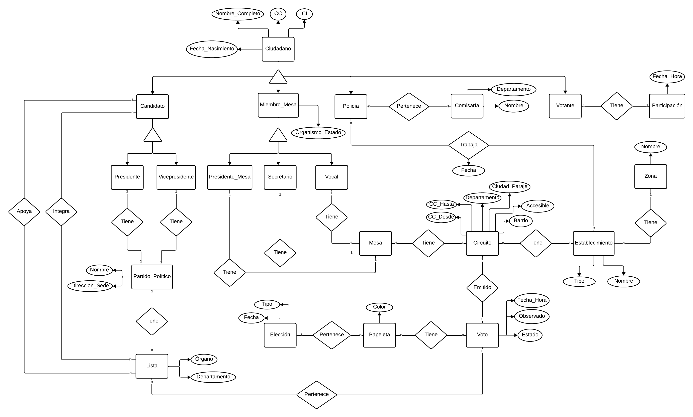

# Votación Electrónica — BD2

**Grupo C** · Leandro Pereira y Gabriel Fioritti · Universidad Católica del Uruguay · Campus Salto

Prototipo de sistema de votación electrónica para la Corte Electoral de Uruguay. El modelo de datos cubre elecciones municipales, presidenciales, ballotage, plebiscito y referéndum, con énfasis en mantener el **secreto del voto** separando la participación del contenido del voto.

Hecho con MySQL 8, Node.js con Express del lado del servidor, y HTML, CSS y JS del lado del cliente. Todo corre en Docker.

## Arrancar

### En desarrollo

```bash
docker compose up --build
```

Los archivos de `server/`, `public/` y `database/` se montan como volúmenes, así que cualquier cambio se ve al instante. El servidor se reinicia solo con `node --watch`.

Abrir [http://localhost:3000](http://localhost:3000)

### En producción

```bash
docker compose -f docker-compose.prod.yml up --build -d
```

El código queda embebido en la imagen, los contenedores se reinician si fallan. Sin volúmenes ni recarga.

### Sin Docker

```bash
npm install
# Copiar .env.example a .env, configurar MySQL local
npm run init-db
npm start
```

Abrir [http://localhost:3000](http://localhost:3000)

### Usuarios de prueba

Los tres roles vienen precargados al iniciar la base de datos:

| Rol | CI | Contraseña |
|-----|----|------------|
| Votante | 12345678 | votante123 |
| Presidente de mesa | 34567890 | presidente123 |
| Admin | 23456789 | admin123 |

## Lo que hace el sistema

Tres perfiles, cada uno con su pantalla:

**Votante** — se registra, inicia sesión, elige su circuito, selecciona una o más listas y emite el voto. Si vota en un circuito distinto al que le corresponde por padrón, el voto se marca como observado y necesita autorización del presidente de mesa. No puede votar dos veces en la misma elección.

**Presidente de mesa** — ve los votos observados pendientes de autorizar y los autoriza con un clic. Cierra la mesa cuando termina la votación (una vez cerrada, no se puede reabrir ni aceptar más votos). Ve los resultados de su circuito (solo disponibles después del cierre) y reportes globales por departamento, partido y candidato (solo incluyen datos de mesas cerradas).

**Admin** — carga elecciones, partidos políticos, listas, candidatos y asigna votantes a circuitos. Todo desde pestañas en una misma pantalla.

### Voto en blanco y anulado

Si el votante selecciona listas de partidos distintos o más de dos listas idénticas, el sistema anula el voto automáticamente. También se puede marcar como voto en blanco.


## Cómo está modelada la base de datos

Son +20 tablas. Lo más importante del diseño:

**Secreto del voto.** La tabla `participacion` registra qué ciudadano votó y en qué elección. La tabla `voto` registra qué se votó (circuito, listas, papeletas, estado). No hay ninguna clave foránea que las vincule. Es imposible reconstruir quién votó qué.

**Tipos de elección.** El campo `tipo` de `eleccion` acepta `presidencial`, `municipal`, `ballotage`, `plebiscito` y `referendum`. Cada elección puede tener múltiples papeletas, y un voto puede incluir tanto listas como papeletas simultáneamente (para cuando hay más de una elección en la misma jornada).

**Circuitos y mesas.** Cada circuito tiene un rango de credenciales cívicas habilitadas, un establecimiento, un departamento, y una mesa con presidente, secretario y vocal. Los miembros de mesa son empleados públicos (vinculados a un organismo del Estado). Los policías asignados a cada establecimiento pueden pertenecer a comisarías de otro departamento.

**Reportes.** Tres consultas agregadas: votos por departamento, por partido y por candidato, cada una desglosando válidos, observados y anulados. Coinciden exactamente con las consultas pedidas en la consigna.



## APIs

20 endpoints en total, agrupados en tres archivos:

| Router | Endpoints |
|--------|-----------|
| `routes/auth.js` | login, register |
| `routes/admin.js` | CRUD de departamentos, circuitos, elecciones, partidos, listas, candidatos, votantes, establecimientos |
| `routes/votacion.js` | emitir voto, autorizar observado, cerrar mesa, resultados por circuito, reportes por departamento/partido/candidato, listas de una elección, votos observados pendientes |

## Archivos del proyecto

```
database/
  schema.sql          # Creación de tablas (modelo físico)
  seed.sql            # Datos de ejemplo: elección municipal en Salto y Artigas
  queries.sql         # Consultas de reportes pedidas en la consigna
server/
  index.js            # Express, middlewares y rutas
  db.js               # Pool de conexiones MySQL
  routes/
    auth.js           # Login y registro
    admin.js          # ABM de datos
    votacion.js       # Votación, cierre, resultados, reportes
public/
  index.html          # Interfaz web
  app.js              # Lógica del frontend
  styles.css          # Estilos
docs/
  BD2_Trabajo_Obligatorio-Grupo_C.pdf   # Informe final
  MER.png                               # Modelo Entidad-Relación
```

## Docker

Dos archivos de compose:

| Entorno | Archivo | Comando |
|---------|--------|---------|
| Desarrollo | `docker-compose.yml` | `docker compose up` |
| Producción | `docker-compose.prod.yml` | `docker compose -f docker-compose.prod.yml up -d` |

En desarrollo los directorios `server/`, `public/` y `database/` se montan como volúmenes dentro del contenedor, permitiendo editar y ver los cambios sin reconstruir la imagen.
